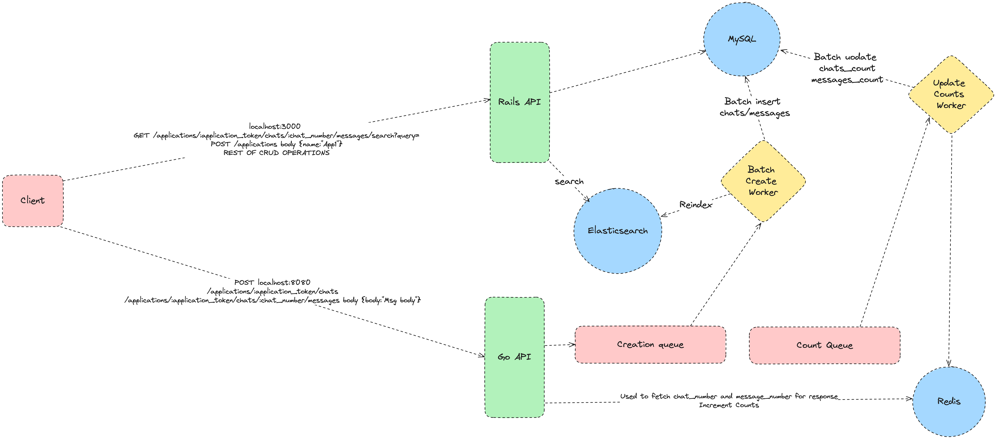

# Chat System API

This repository contains the code for building a RESTful API for a chat system. The system allows creating new applications, managing chats within applications, and sending messages. Below is the guide on how to set up and run the project.

## Table of Contents

- [Functional Requirements](#functional-requirements)
- [Non-Functional Requirements](#non-functional-requirements)
- [Technologies Used](#technologies-used)
- [Database Schema](#database-schema)
- [System Design And API Endpoints](#system-design-and-api-endpoints)
- [Running the Application](#running-the-application)

## Functional Requirements

1. **Application Management**:

   - Ability to create new applications with a generated token and provided name.
   - Applications have a unique token and name.

2. **Chat Management**:

   - Each application can have multiple chats.
   - Chats are numbered, starting from 1, within each application.
   - No two chats within the same application can have the same number.

3. **Message Management**:

   - Each chat can contain multiple messages.
   - Messages are numbered, starting from 1, within each chat.

4. **Message Search**:
   - An endpoint to search messages within a specific chat using Elasticsearch.
   - Messages' bodies are partially matchable.

## Non-Functional Requirements

1. **Scalability**:

   - The system handles multiple concurrent requests efficiently.
   - Race conditions are handled appropriately, especially for concurrent requests.

2. **Performance**:

   - Optimize database queries and minimize writing directly to MySQL.
   - Use a queuing system for handling chat and message creation endpoints and counting jobs to improve performance by creating chats and messages in bulks and counting hourly and committing to MySQL in a single query.
   - Tables are optimized with needed indices.

3. **Data Consistency**:
   - Columns `chats_count` and `messages_count` are be maintained in the database, with a 1-hour lag.

## Technologies Used

- Ruby on Rails (API)
- MySQL (Main Datastore)
- ElasticSearch (For message search functionality)
- Sidekiq (For background jobs)
- Redis (For Sidekiq and caching)
- GoLang (Chat/Message creation Endpoints)
- Docker (Containerization)

## Database Schema

### Applications Table

| Column Name | Data Type | Description               |
| ----------- | --------- | ------------------------- |
| id          | INTEGER   | Primary key               |
| token       | STRING    | Unique identifier for app |
| name        | STRING    | Name of the application   |
| chats_count | INTEGER   | Number of chats in app    |

### Chats Table

| Column Name    | Data Type | Description                                |
| -------------- | --------- | ------------------------------------------ |
| id             | INTEGER   | Primary key                                |
| application_id | INTEGER   | Foreign key referencing Applications table |
| number         | INTEGER   | Unique number within each application      |
| messages_count | INTEGER   | Number of messages in chat                 |

### Messages Table

| Column Name | Data Type | Description                         |
| ----------- | --------- | ----------------------------------- |
| id          | INTEGER   | Primary key                         |
| chat_id     | INTEGER   | Foreign key referencing Chats table |
| number      | INTEGER   | Unique number within each chat      |
| body        | TEXT      | Content of the message              |

### System Design And API Endpoints



## Running the Application

1. Ensure Docker and Docker Compose are installed on your system.
2. Clone this repository and navigate to its directory.
3. Rename the `.env.example` file to `.env`.
4. Run the following command:

```bash
docker-compose up --build
```

This command will build and run the entire stack including the Ruby on Rails application, workers, MySQL, ElasticSearch, Redis, and any other required components.

You can now access the API endpoints as described in the project's documentation.
